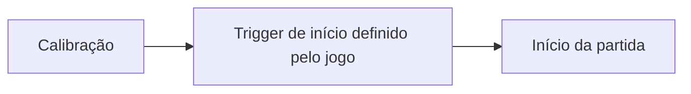

# AR/MR Game Design Document Builder

## Por que essa skill existe

Um GDD de jogo AR/MR precisa de seções que um GDD normal não tem — espaço físico, relação câmera-jogo, tracking, segurança. É fácil documentar um jogo que "usa AR" mas na prática funcionaria igual numa tela plana. Essa skill existe pra evitar isso: toda mecânica documentada passa pelo teste AR-nativo antes de virar seção final.

## O princípio central: teste AR-nativo

Antes de escrever qualquer mecânica no documento, pergunte: **"isso funciona igual numa tela sem câmera?"**

Se a resposta for sim, a mecânica não é AR de verdade. Não a reescreva sozinho — aponte o problema pro usuário e pergunte como ele quer resolver. Decisão de design é dele, não sua. Aplique esse filtro em toda seção de mecânicas, não só uma vez no início.

## Como conduzir o processo

### 1. Reúna o que já existe antes de perguntar

Antes de fazer qualquer pergunta, procure no repositório por documentação já existente (README, pasta `docs/`, arquivos de design, moodboards, imagens). Releia também a conversa atual — o usuário costuma já ter decisões tomadas que não precisam ser perguntadas de novo. Perguntar algo que já foi respondido é o erro mais irritante que essa skill pode cometer.

### 2. Entreviste em lotes pequenos e pausados

Regra: no máximo 3 perguntas por vez, e sempre pare depois de cada lote pra esperar a resposta antes de continuar. Nunca lance um questionário inteiro de uma vez — o usuário prefere revisar aos poucos.

Ordem sugerida dos lotes (pule os que já tiverem resposta no repositório ou na conversa):

1. **Visão** — nome do jogo, gênero, pitch em 2-3 frases
2. **Espaço físico** — área necessária, indoor/outdoor, parado vs. andando
3. **Câmera como mecânica** — o que a câmera precisa "ver"; aplique o teste AR-nativo na mecânica central aqui
4. **Referências visuais** — peça pra linkar ou anexar moodboard, prints, ou nomear jogos/animes/produtos de referência
5. **Progressão e economia**
6. **Escopo técnico** — engine, plataforma, restrições já conhecidas

Quando a pergunta tiver respostas curtas e discretas (ex: "indoor ou outdoor?"), prefira usar uma ferramenta de múltipla escolha em vez de texto livre — é mais rápido pro usuário responder. Use texto livre só quando a resposta exigir explicação.

### 3. Escreva um arquivo por vez, pare pra revisão

Depois de escrever cada arquivo, pare e pergunte se está bom antes de seguir pro próximo. Não gere os 8 arquivos de uma vez — o usuário prefere consolidar por partes.

## Estrutura de arquivos do GDD

Escreva o GDD como uma pasta `gdd/` com um arquivo markdown por seção:

```
gdd/
  00-visao-geral.md
  01-core-loop.md
  02-mecanicas-ar.md
  03-progressao-economia.md
  04-fluxo-sessao.md
  05-hud-ui.md
  06-personagens-conteudo.md
  07-escopo-tecnico.md
  08-referencias.md
```

### O que cada arquivo precisa conter

**00-visao-geral.md** — o que é o jogo em 2-3 frases, gênero, plataforma, público.

**01-core-loop.md** — o que o jogador faz repetidamente, minuto a minuto. Sem detalhe técnico ainda, só o ritmo da experiência.

**02-mecanicas-ar.md** — o coração do documento. Precisa cobrir, pra cada mecânica:
- resultado do teste AR-nativo (funciona sem câmera? sim/não, e por quê)
- espaço físico exigido pela mecânica
- campo de visão / atenção: o que fica dentro e fora, e o que isso significa pro jogador
- escala e ancoragem dos objetos virtuais
- limitações de tracking conhecidas (drift, perda de rastreio, recalibração)
- orientação e ergonomia (retrato/paisagem, como o jogador segura o dispositivo)
- segurança física (risco de colisão, uso em espaço público)
- onboarding físico (como o jogador aprende a se posicionar sem instrução longa)
- áudio espacial, se houver
- como a mecânica aparece pra quem está de fora olhando

**03-progressao-economia.md** — o que se ganha, gasta, coleciona; como o jogo evolui.

**04-fluxo-sessao.md** — do início ao fim de uma partida, passo a passo. Inclui o storyboard das sequências-chave (ver "Storyboard" em Recursos visuais) — é o formato certo pra mostrar o que a câmera vê e o que o jogador faz fisicamente, quadro a quadro, algo que texto sozinho não comunica bem em AR.

**05-hud-ui.md** — o que aparece na tela e por quê.

**06-personagens-conteudo.md** — lista do que existe (personagens, inimigos, itens).

**07-escopo-tecnico.md** — engine, plataforma, restrições técnicas já validadas ou conhecidas.

**08-referencias.md** — moodboard, jogos/animes/produtos citados como referência, e o que cada um empresta pro design.

## Recursos visuais

O usuário é muito visual — diagrama junto do texto não é enfeite, é como ele revisa o documento. Você não tem uma ferramenta de gerar imagem embutida, mas tem duas formas de criar visual direto no markdown, sem depender de nada externo:

**Mermaid** — pra fluxos, sequências e estados. Renderiza nativo no GitHub e na maioria dos visualizadores de markdown. Use pra:
- fluxo de sessão (`04-fluxo-sessao.md`): diagrama do início ao fim de uma partida
- core loop (`01-core-loop.md`): diagrama do loop principal
- sistemas com estado (ex: um boss que muda de fase, uma economia com gatilhos): diagrama de estados

Embuta assim, direto no arquivo:
````

````

**SVG** — pra qualquer coisa espacial/geométrica que o Mermaid não representa bem: layout de arena, campo de visão, posicionamento de flancos, escala de objetos. Desenhe um SVG simples (visão de cima, formas básicas, texto rotulando cada elemento), salve como arquivo `.svg` na mesma pasta do markdown correspondente, e referencie com ``. Não precisa ser bonito — precisa ser claro.

**Onde cada diagrama entra**: sempre logo depois do trecho de texto que ele ilustra, nunca separado numa seção "diagramas" no fim do documento — o usuário quer ver o desenho junto da explicação.

**Storyboard**: para sequências-chave (onboarding/trigger de início, boss intro, vitória/derrota — qualquer momento onde a ordem física de ações importa), monte um storyboard quadro a quadro dentro de `04-fluxo-sessao.md`. Cada quadro é um SVG simples mostrando: o que a câmera enquadra naquele momento + o que o jogador está fazendo fisicamente + o gatilho que leva ao próximo quadro. Além dos SVGs embutidos em sequência no markdown, monte também um arquivo `storyboard.html` na mesma pasta que junta todos os quadros lado a lado (ou em grade) — isso serve pra validação rápida: o usuário abre o HTML no navegador e consegue olhar a sequência inteira de uma vez, em vez de rolar o markdown quadro por quadro. Referencie o `storyboard.html` no topo da seção de storyboard dentro do markdown.

**Imagens de referência e concept art**: se houver uma skill de geração de imagem disponível no ambiente, verifique antes de assumir que não tem — se tiver, ofereça gerar concept art de personagens pra `06-personagens-conteudo.md`. Se não tiver, não invente descrição de imagem no lugar de uma imagem real; peça pro usuário anexar ou linkar o material (moodboard, prints, referências) e organize em `08-referencias.md`.

## Formato de cada seção

Dentro de cada arquivo, prefira texto curto + bullets a parágrafos longos. Onde uma mecânica vira spec técnica (valores, condições, fórmulas), escreva de forma exata — é o que vai virar código depois. Onde é intenção de design, pode ficar mais solto.

## Exemplo de pergunta boa vs. ruim nos lotes de entrevista

**Ruim** (textão, várias perguntas sem pausa):
> "Me conta sobre o espaço físico do jogo, o público-alvo, a plataforma, o orçamento, o cronograma e também as referências visuais que você tem em mente."

**Bom** (lote pequeno, foco):
> "Três coisas sobre o espaço físico: 1) precisa de quanto de área livre? 2) indoor, outdoor, ou os dois? 3) o jogador fica parado ou anda?"

## No final

Depois que todos os arquivos estiverem escritos e revisados, ofereça um resumo de 3-4 linhas do que foi documentado e pergunte se falta alguma seção antes de considerar o GDD pronto pra virar tarefa de implementação.