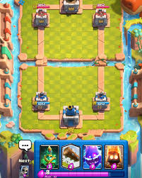

# Tower Gate

Jogo de cartas em Realidade Aumentada, inspirado no Clash Royale.



## Por que este projeto existe

Tower Gate é um laboratório. A pergunta que ele responde é:

> **Dá para criar jogos e experiências imersivas de verdade rodando na web?**

O jogo é o meio, não o fim. Cada mecânica serve para testar um limite da
plataforma.

## Tecnologias

- **Babylon.js** — renderização 3D
- **8th Wall Engine** (`@8thwall/engine-binary`) — tracking SLAM por câmera, roda
  em qualquer navegador mobile, iOS Safari incluído
- TypeScript + Vite

## Como rodar

```bash
npm install
npm run dev
```

O dev server sobe em **HTTPS** com certificado autoassinado, porque acesso à
câmera exige contexto seguro. Para testar no celular, acesse
`https://<ip-da-maquina>:5173` na mesma rede e aceite o aviso de certificado.

Build de produção:

```bash
npm run build
```

## Como rodar os testes

```bash
npm test
```

## Estado do projeto

O quadro de trabalho — o que está pronto, o que falta e a evidência de cada item
— vive em [`docs/specs-arena-180/README.md`](docs/specs-arena-180/README.md).
Se qualquer outro documento discordar do quadro, o quadro está certo.

## Diários de experimento

Cada linha de investigação tem um diário em
[`docs/experimentos/`](docs/experimentos/README.md): o que foi tentado, o que
cada tentativa provou, o que falhou e quais hipóteses foram abandonadas — com o
motivo.

**Leia o diário da área antes de mexer nela.** É o que evita repetir caminho já
descartado.

| Diário | Assunto |
| --- | --- |
| [`arena-180-atencao.md`](docs/experimentos/arena-180-atencao.md) | Ativo: a v3 e se a RA dá para ser mecânica em vez de cenografia |
| [`pet-sandbox.md`](docs/experimentos/pet-sandbox.md) | Ativo: coerência espacial de dois objetos, e o chão digital que substituiu o `hitTest` |
| [`demo-mundo-vivo.md`](docs/experimentos/demo-mundo-vivo.md) | Encerrado: histórico de RA — calibração, gate de colocação, armadilhas de GUI |
| [`ra-e-paisagem.md`](docs/experimentos/ra-e-paisagem.md) | Estabilidade da arena e orientação de tela |
| [`ferramental-de-sessao.md`](docs/experimentos/ferramental-de-sessao.md) | Como o projeto registra o próprio progresso entre sessões |

Os diários são escritos pela skill `encerrar-sessao`
(`.claude/skills/encerrar-sessao/SKILL.md`), acionada ao fim de cada sessão.