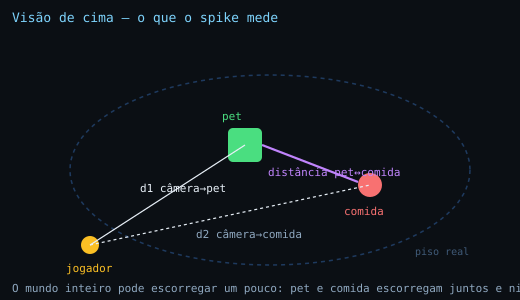
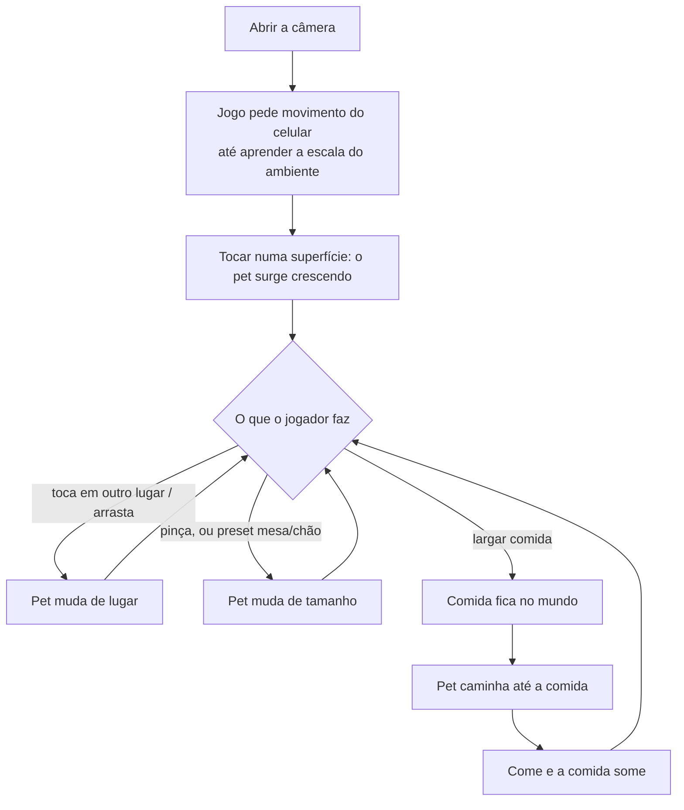

# Spike — pet sandbox: colocar, mover, escalar, alimentar

Fatia mínima para validar se as quatro ações **se sentem bem** em AR. Não é fatia de jogo:
não tem personalidade do pet, progressão, nem arte final.

## A pergunta do spike

Cada ação, isolada, é fácil de acreditar que funciona. O risco está na soma: **o pet
continua sendo o mesmo objeto, no mesmo lugar, depois de o jogador mexer nele?**

E a pergunta que decide se existe jogo de pet:

> **O pet e a comida, colocados em momentos diferentes, continuam à mesma distância um do
> outro depois que o jogador anda pela sala?**

Se o mundo inteiro escorregar um pouco, tudo bem — o jogador não percebe, porque pet e
comida escorregam juntos. O que quebra a ilusão é a **distância entre os dois** mudar: o
pet caminha até onde a comida estava e ela não está mais lá.

## As quatro ações, do ponto de vista do jogador

### 1. Colocar o pet

O jogador aponta o celular para uma superfície e toca onde quer o pet. O pet **surge
crescendo** naquele ponto, do tamanho de um bicho de verdade daquele tamanho.

Antes disso o jogo pede que ele movimente o celular um pouco — é o momento em que o jogo
aprende a escala do ambiente. Nada aparece antes disso terminar.

### 2. Mover o pet de lugar

Duas formas possíveis, e o spike testa **as duas** para decidir:

- **Tocar no lugar novo** — o pet vai para lá.
- **Arrastar** — o dedo puxa o pet, que acompanha deslizando pela superfície.

Arrastar é o que todo mundo espera, e é onde mora a armadilha: se o pet deslizar por uma
superfície *imaginária* em vez da superfície real, ele passa a flutuar ou afundar quando o
jogador se aproxima. O spike compara as duas e mede qual delas mantém o pet colado ao
chão.

### 3. Ajustar o tamanho

Pinça para escalar, livre. Uma porcentagem fica visível, e **voltar ao tamanho real é um
toque só** — é o que impede o jogador de perder a referência de quão grande o bicho
realmente é.

**A necessidade de escalar nasce da superfície real:** o tamanho natural funciona no chão
e fica desconfortável na mesa. Por isso o jogo já entrega o pet no tamanho provável — ele
sabe se o jogador apontou para uma mesa ou para o chão, e escolhe entre "tamanho de mesa"
(bem menor) e "tamanho de chão". A pinça é o ajuste fino por cima disso.

**Ergonomia é parte da ação, não detalhe:** em AR uma das mãos segura o aparelho, e pinça
pede duas. Tem que existir um caminho de **um dedo só** para o mesmo resultado — os
presets mesa/chão e o retorno ao tamanho real. O spike valida escalando de pé, com uma mão.

### 4. Dar comida

O jogador toca num ponto do chão para largar a comida. **A comida fica no mundo, não na
tela** — ela é um segundo objeto colocado no espaço real, a metros do pet se for o caso.

O pet então caminha até ela, para, e come. É aqui que a coerência entre os dois objetos
aparece para o jogador: se ela falhou, ele vê o pet parar no lugar errado.

## Teste AR-nativo

| Ação | Existiria numa tela sem câmera? | Veredito |
|---|---|---|
| **Colocar** | Não — o alvo é uma superfície real, à distância real | AR-nativo. É o núcleo. |
| **Mover** | Só se deslizar pela superfície **real** | AR-nativo na versão certa; falso na versão que usa uma superfície imaginária |
| **Escalar** | O gesto sim; **o motivo dele existir, não** | AR-nativo — quem cria a necessidade é a mesa vs. o chão |
| **Alimentar** | Um botão "alimentar" seria idêntico numa tela | AR-nativo **só** na versão em que a comida ocupa um lugar no mundo e o pet precisa ir até lá |

Nota de método: uma versão anterior deste documento reprovou a escala aplicando o teste
**ao gesto** (pinça é screen-space) em vez de **ao motivo da mecânica existir**. Pelo
critério do gesto, tocar também é screen-space e "colocar" cairia junto. O critério é o
motivo, não o dedo.

## Fluxo da sessão

## O que o jogador deve sentir (critérios de aprovação)

Testado em pé, andando pela sala, por 60 s.

| # | O jogador… | Passa quando |
|---|---|---|
| 1 | anda pela sala e volta | o pet ainda está **no mesmo lugar do móvel real** onde foi posto |
| 2 | se aproxima do pet de longe | o pet **não desliza** pelo chão conforme ele chega perto |
| 3 | gira 360° no lugar | ao voltar, o pet ainda está reconhecivelmente onde estava |
| 4 | põe a comida longe e espera | o pet **para em cima da comida**, não ao lado dela |
| 5 | dá pinça de bem pequeno a bem grande | o pet cresce **sem sair do lugar** |
| 6 | arrasta o pet pelo chão | o pet fica **colado** na superfície, sem flutuar nem afundar |
| 7 | aponta para uma mesa e depois para o chão | o tamanho sugerido acerta o contexto |
| 8 | está de pé, uma mão só | consegue ajustar o tamanho sem apoiar o celular |
| 9 | usa o jogo por 60 s | fluido, sem travar, em Android e iPhone |

**Reprovam o spike:** 1, 4 ou 5.
- **1** — se o pet não fica onde foi posto, nenhuma das outras ações importa.
- **4** — se pet e comida não coexistem, não existe jogo de pet com comida.
- **5** — se escalar move o pet, escalar e ancorar estão brigando.

## Se reprovar, o próximo passo não é insistir

Se a coerência entre pet e comida (critério 4) falhar, a saída não é ajustar o
posicionamento: é ancorar tudo num **alvo impresso** — um tapetinho que o jogador põe no
chão. Aí os dois objetos ficam presos ao mesmo marcador físico e a distância entre eles
passa a ser estruturalmente estável. Custa pedir um objeto físico ao jogador; resolve a
classe inteira do problema.

## O que este spike não responde

Personalidade e comportamento do pet, progressão, economia, arte final, e se o pet
continua na sala quando o jogador fecha e reabre o app.

---

*As restrições de implementação (ancoragem, tracking, limites do engine) não estão aqui de
propósito — elas vivem na skill `babylonjs-game-dev`.*
